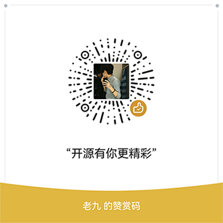

# KestrelApp
基于Kestrel的网络编程应用示例

### 项目用途
1. 了解网络编程不再需要从Socket开始
2. 了解网络编程不再需要第三方框架(包括Dotnetty)
3. 了解`telnet` over `websocket` over `tls` over `xxx私有加密` over `tcp`的套娃网络编程

### 更多文档
#### 内部文档库
[docs](docs)

#### 外部文档
* [Pipelines](https://learn.microsoft.com/zh-cn/dotnet/standard/io/pipelines)
* [Buffers](https://learn.microsoft.com/zh-cn/dotnet/standard/io/buffers)

### 项目介绍
#### 1 KestrelApp.Client
让项目支持IConnectionFactory依赖注入，方便从Socket创建ConnectionContext对象

#### 2 KestrelApp.Telnet
Telnet协议的简单示例项目，内容包括
1. 了解Kestrel的ConnectionHandler
2. 了解PipeReader和PipeWriter

#### 3 KestrelApp.HttpProxy
基于kestrel实现的http代理服务器，内容包括
1. Kestrel的中间件编写
2. Kestrel的Feature使用
3. Kestrel的Transport流量转发
4. Http中间件的编写
5. Yarp的简单使用

#### 4 KestrelApp.TlsDetect
客户端流量tls协议侦测，内容包括
1. Kestrel的Transport流量协议侦测
2. 单端口多协议服务器的编写技巧

#### 5 KestrelApp.Transforms
Kestrel流量的变换，内容包括
1. IDuplexPipe包装为Stream
2. Stream委托
3. Kestrel的Transport的替换
4. 全局流量分析和流量加解密

### 开源有你更精彩

